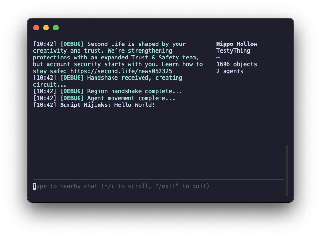

import { PersonStandingIcon } from "lucide-react"
import { SiGithub } from "@icons-pack/react-simple-icons"

<Callout type="warn">

**This client is a work in progress!**

It is not intended for use yet, it only features basic chat functionality. Teleporting, and other features are not yet implemented.

Several steps need to be made before we apply to the [TPV Directory](https://wiki.secondlife.com/wiki/Third_Party_Viewer_Directory), think of that what you will.

</Callout>

## Introduction

Node.js powered text client that allows basic interactions with the virtual world
[Second Life](https://www.secondlife.com), utilizing the official
[Second Life UDP protocol](http://wiki.secondlife.com/wiki/Protocol).

Homunculus _is not affiliated with or sponsored by Linden Research, Linden Lab or
Second Life._

### Features

- Local chat interactions
- Minimal details about nearby objects and avatars
- More to come later...

### Basic Usage

Install either [Node.js](https://nodejs.org) or [Bun](https://bun.sh).

```shell
npx @gwigz/homunculus-terminal

# or at a specific location
npx @gwigz/homunculus-terminal --start "uri:Hippo Hollow&128&128&2"

# also works with Bun (preferred method)
bunx --bun @gwigz/homunculus-terminal
```

Downloadable binaries will be available later.

### Tips

- Use escape key, `/exit`, or `/quit` to disconnect
- Use [environment values](https://github.com/gwigz/homunculus/blob/main/.env.example) to persist credentials, built-in functionality is coming soon
- Using `bunx` or `npx` will keep the package up to date automatically

### Screenshots

<div className="flex justify-center [&_*]:m-0">



</div>

## Resources

<Cards>
  <Card icon={<PersonStandingIcon />} title="Homunculus Core" href="/docs/core">
    Check out our client framework
  </Card>
  <Card
    icon={<SiGithub />}
    title="GitHub"
    href="https://github.com/gwigz/homunculus/tree/main/apps/homunculus-terminal"
  >
    Check out the source code
  </Card>
</Cards>
