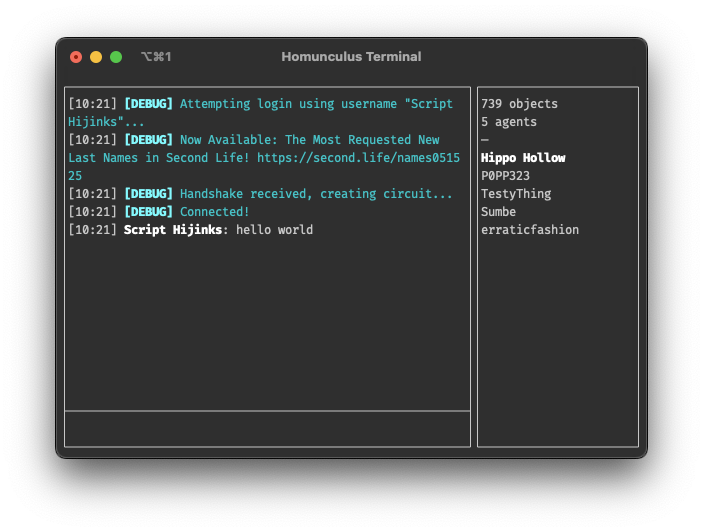

# `@gwigz/homunculus-terminal`

Node.js powered text client that allows basic interactions with the virtual world
[Second Life](https://www.secondlife.com), utilizing the official
[Second Life UDP protocol](http://wiki.secondlife.com/wiki/Protocol).

## Features

- Local chat interactions
- Minimal details about nearby objects and avatars
- More to come later...

## Usage

Currently requires [environment values](https://github.com/gwigz/homunculus/blob/main/.env.example) for login credentials, a more complete built-in login form will come later.

```shell
npx @gwigz/homunculus-terminal

# or at a specific location
npx @gwigz/homunculus-terminal --start "uri:Hippo Hollow&128&128&2"

# also works with Bun (preferred method)
bunx @gwigz/homunculus-terminal
```

Use `/exit` or `/quit` to disconnect.

<div align="center">
  
</div>

## Acknowledgments

Homunculus has been made possible thanks to these wonderful resources:

- [`libopenmetaverse`](https://github.com/openmetaversefoundation/libopenmetaverse) for kicking off the open-source "metaverse" community
- [`pyogp`](http://wiki.secondlife.com/wiki/PyOGP) by the late Enus Linden and their team
- `node-omv` by Wolfspirit for their proof of concept
- [`node-metaverse`](https://github.com/CasperTech/node-metaverse) for delaying my efforts on [`sljs`](https://github.com/gwigz/sljs-archive)

## Links

- [GitHub Repository](https://github.com/gwigz/homunculus)
- [Issue Tracker](https://github.com/gwigz/homunculus/issues)
